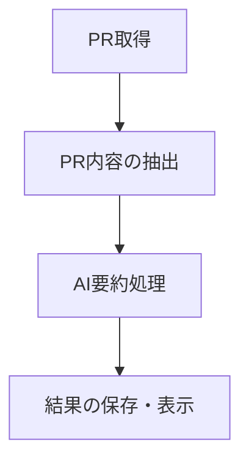

# PR内容のAIサマライズ機能設計書

## 1. 機能概要

Repository Sprint Digestに「AI駆動のPRサマリー生成」機能を追加し、マージされたPRの内容をAIが自動的に要約・分析することで、開発チームの情報把握を効率化します。

### 目的
- PRの内容を自動的に要約し、重要なポイントを抽出
- チームメンバーが多数のPRの内容を素早く理解できるようにする
- スプリントレビューや進捗報告の準備時間を短縮

### 期待される効果
- 情報把握の効率化
- コミュニケーションの円滑化
- 開発活動の透明性向上

## 2. 実装アプローチ

### 基本設計



### 処理フロー
1. GitHubからマージされたPRの情報を取得
2. 各PRの詳細情報（説明、変更内容）を抽出
3. LangChainとOpenAI APIを使用して内容を要約
4. 要約結果を既存の出力フォーマットに統合

### コスト最適化戦略

1. **トークン最適化**:
   - PRの内容を要約前に前処理（コードブロックの削減、冗長な情報の除去）
   - 必要な情報のみを抽出してAPIに送信（タイトル、説明、主要な変更点のみ）

2. **モデル選択**:
   - 要約処理には`gpt-3.5-turbo`を使用（コスト効率が良い）
   - 必要に応じて将来的により安価なモデルへの切り替えも検討

3. **バッチ処理**:
   - 複数のPRをまとめて処理し、APIコール回数を削減
   - 定期実行時に増分処理（前回実行以降の新規PRのみ処理）

## 3. 技術的な詳細

### 使用技術
- **LangChain**: AIとの連携を効率化するフレームワーク
- **OpenAI API**: テキスト生成と要約のためのAIモデル
- **GitHub API**: PR情報の取得

### LangChainの活用
- テキスト分割とチャンキングのためのTextSplitterを使用
- プロンプトテンプレートを活用して一貫した要約を生成
- 必要に応じてRAGパターンを実装して関連コンテキストを提供

### 必要な変更点
- `src/github.js`に新しい関数を追加してPRの詳細コンテンツを取得
- 新しいモジュール`src/ai.js`を作成してAI処理を担当
- 設定ファイル`config/ai-config.json`を追加してAI関連の設定を管理

### 出力フォーマット拡張
各出力フォーマットに要約情報を追加：

#### Markdown形式
```markdown
# PR Change History (2023-04-01)

## 2023-04-01
- [#123](https://github.com/owner/repo/pull/123) PR Title (@author)
  > AIによる要約: このPRでは○○機能を追加しています。主な変更点は...
```

#### JSON形式
```json
{
  "repository": "owner/repo",
  "pr_history": {
    "2023-04-01": [
      {
        "number": 123,
        "title": "PR Title",
        "url": "https://github.com/owner/repo/pull/123",
        "author": "author",
        "mergedAt": "2023-04-01T14:32:25Z",
        "summary": "AIによる要約: このPRでは○○機能を追加しています。主な変更点は..."
      }
    ]
  }
}
```

#### YAML形式
```yaml
repository: owner/repo
pr_history:
  '2023-04-01':
    - number: 123
      title: PR Title
      url: https://github.com/owner/repo/pull/123
      author: author
      mergedAt: '2023-04-01T14:32:25Z'
      summary: 'AIによる要約: このPRでは○○機能を追加しています。主な変更点は...'
```

## 4. 実装ステップ

### 1. 環境設定
- LangChainとOpenAI SDKをインストール
```bash
npm install langchain @langchain/openai
```
- 環境変数に`OPENAI_API_KEY`を追加（`.env`ファイルに追記）
```
OPENAI_API_KEY=your_api_key_here
```

### 2. PR内容取得機能の拡張
GitHub APIを使用してPRの詳細（説明、変更内容）を取得する機能を追加します。

```javascript
// src/github.js に追加
async function getPRDetails(owner, repo, prNumber) {
  // PRの詳細情報を取得
  const { data: prData } = await octokit.pulls.get({
    owner,
    repo,
    pull_number: prNumber
  });

  // PRの変更ファイル情報を取得
  const { data: filesData } = await octokit.pulls.listFiles({
    owner,
    repo,
    pull_number: prNumber
  });

  return {
    title: prData.title,
    description: prData.body || '',
    changedFiles: filesData.map(file => ({
      filename: file.filename,
      status: file.status,
      additions: file.additions,
      deletions: file.deletions,
      changes: file.changes
    }))
  };
}
```

### 3. AI要約処理の実装
新しいモジュール`src/ai.js`を作成し、LangChainとOpenAI APIを使用してPR内容を要約します。

```javascript
// src/ai.js
const { ChatOpenAI } = require('@langchain/openai');
const { PromptTemplate } = require('langchain/prompts');

// OpenAI モデルの初期化
const chatModel = new ChatOpenAI({
  modelName: 'gpt-3.5-turbo',
  temperature: 0.2
});

// PR要約用のプロンプトテンプレート
const summarizeTemplate = PromptTemplate.fromTemplate(
  `あなたはGitHubのPull Requestを要約する専門家です。
   以下のPR情報を簡潔に要約してください。
   主な変更点、目的、影響範囲に焦点を当ててください。

   PRタイトル: {title}
   PR説明: {description}
   変更ファイル: {files}

   要約:`
);

async function summarizePR(prDetails) {
  const filesInfo = prDetails.changedFiles.map(file =>
    `${file.filename} (${file.status}, +${file.additions}, -${file.deletions})`
  ).join('\n');

  const prompt = await summarizeTemplate.format({
    title: prDetails.title,
    description: prDetails.description,
    files: filesInfo
  });

  const response = await chatModel.invoke(prompt);
  return response.content;
}

module.exports = { summarizePR };
```

### 4. 出力統合
既存の出力フォーマットにAI要約を統合します。

```javascript
// src/github.js の writePRChanges 関数を拡張
const { summarizePR } = require('./ai');

async function writePRChanges(mergedPRs, repository, outputFile, format = 'markdown') {
  // 既存のPR情報に要約を追加
  const prsWithSummary = [];
  for (const pr of mergedPRs) {
    const [owner, repo] = repository.split('/');
    const prDetails = await getPRDetails(owner, repo, pr.number);
    const summary = await summarizePR(prDetails);

    prsWithSummary.push({
      ...pr,
      summary
    });
  }

  // 以下、既存の処理を修正して要約情報を含める
  // ...
}
```

### 5. 出力フォーマットの拡張
Markdown形式の場合、PRリンクの下に要約を追加します。

```javascript
// generateGroupedMarkdownContent 関数を修正
function generateGroupedMarkdownContent(prsByDate, repository) {
  // ...
  for (const date of dates) {
    content += `## ${date}\n\n`;
    for (const pr of prsByDate[date]) {
      content += `- [#${pr.number}](https://github.com/${owner}/${repo}/pull/${pr.number}) ${pr.title} (@${pr.author})\n`;
      if (pr.summary) {
        content += `  > ${pr.summary.replace(/\n/g, '\n  > ')}\n\n`;
      }
    }
    content += '\n';
  }
  // ...
}
```

## 5. コスト見積もりと最適化

### 初期コスト見積もり
1日あたり10件のPRを処理すると仮定した場合：
- 平均PRサイズ: 4KB（約1,000トークン）
- GPT-3.5-turbo使用時: 約$0.002/PR
- 月間コスト（20営業日）: 約$0.40

### 将来的な最適化の方向性
1. **選択的処理の導入**:
   - 重要なPRのみを処理するフィルタリング機能の追加
   - 変更量、影響範囲、特定のパスなどに基づく重要度判断

2. **要約頻度の調整**:
   - 毎日ではなく週次などの頻度で要約を生成
   - バッチ処理によるAPI呼び出しの最適化

3. **プロンプト最適化**:
   - より効率的なプロンプト設計によるトークン使用量の削減
   - 要約の詳細度を調整可能にする

## 6. 将来の拡張計画

### 短期的な拡張
1. **要約品質の改善**:
   - フィードバックに基づくプロンプトの最適化
   - 特定のプロジェクト用語や文脈の理解を向上

2. **選択的処理の導入**:
   - 重要度判断ロジックの実装
   - 設定可能なフィルタリング基準

### 中長期的な拡張
1. **高度な分析機能**:
   - PRの影響範囲の視覚化
   - コード品質や潜在的な問題の指摘
   - 関連するPRやイシューの提案

2. **チーム向け機能**:
   - チームメンバーごとの貢献サマリー
   - スプリントごとの成果まとめ
   - 自動的な会議アジェンダ生成

3. **通知統合**:
   - Slack、Teams、Discordなどへの通知連携
   - 重要なPRの自動ハイライト
