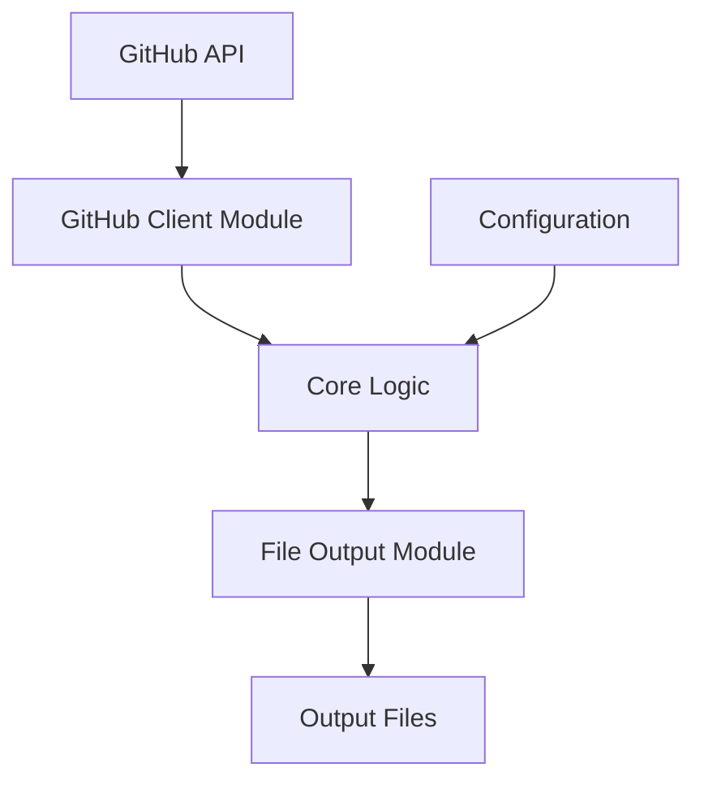
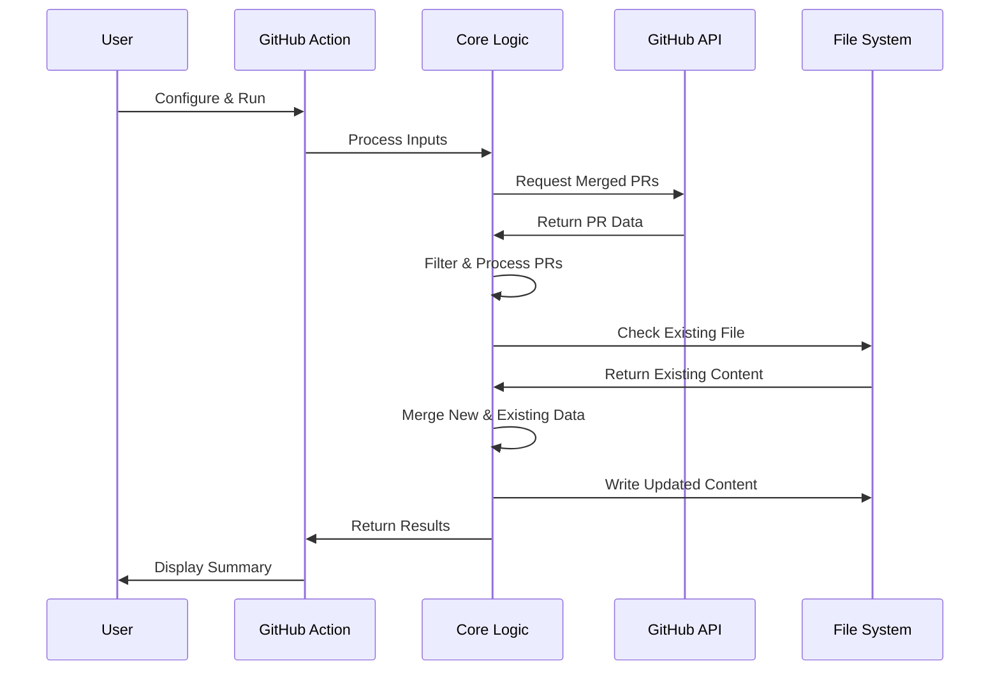

# System Patterns: Repository Sprint Digest

## System Architecture
Repository Sprint Digest follows a simple, modular architecture designed for reliability and maintainability:

### Key Components
1. **GitHub Client Module** (`src/github.js`): Handles all interactions with the GitHub API
2. **Core Logic** (`src/index.js`): Processes inputs, coordinates operations, and manages the workflow
3. **File Output Module** (part of `src/github.js`): Handles reading/writing to output files in various formats
4. **Configuration**: Managed through GitHub Action inputs or environment variables

## Design Patterns

### Command Pattern
The system implements a command-like pattern where the main function acts as an invoker that executes a sequence of operations (fetching PRs, processing data, writing output) based on the provided configuration.

### Adapter Pattern
The system adapts between different data representations (GitHub API responses, internal data structures, and various output formats like Markdown, JSON, and YAML).

### Strategy Pattern
Different output strategies (Markdown, JSON, YAML) are implemented to handle various output format requirements while maintaining a consistent interface.

### Repository Pattern
The GitHub client module abstracts away the details of interacting with the GitHub API, providing a clean interface for the core logic to work with.

## Data Flow

## Key Technical Decisions

### 1. Pagination Handling
- Implements pagination to handle repositories with large numbers of PRs
- Limits to 3 pages (300 PRs) to balance completeness with performance

### 2. Date-Based Organization
- Organizes PRs by merge date rather than creation date or PR number
- Provides a chronological view that aligns with sprint timelines

### 3. Duplicate Prevention
- Maintains a record of previously processed PRs to prevent duplicates
- Supports running the action multiple times without data corruption

### 4. Format Flexibility
- Supports multiple output formats (Markdown, JSON, YAML)
- Each format maintains the same logical organization while adapting to format-specific conventions

### 5. Incremental Updates
- Preserves existing content when updating files
- Adds new PRs to the appropriate date sections rather than overwriting

## Component Relationships

### GitHub Client → Core Logic
- The GitHub client provides PR data to the core logic
- The core logic configures the client with repository and time range parameters

### Core Logic → File Output
- The core logic provides processed PR data to the file output module
- The file output module handles format-specific transformations

### Configuration → Core Logic
- Configuration parameters control the behavior of the core logic
- The core logic validates and applies these parameters

## Error Handling Strategy
- Comprehensive error catching in the main function
- Detailed error logging for troubleshooting
- GitHub Action failure reporting for workflow integration
